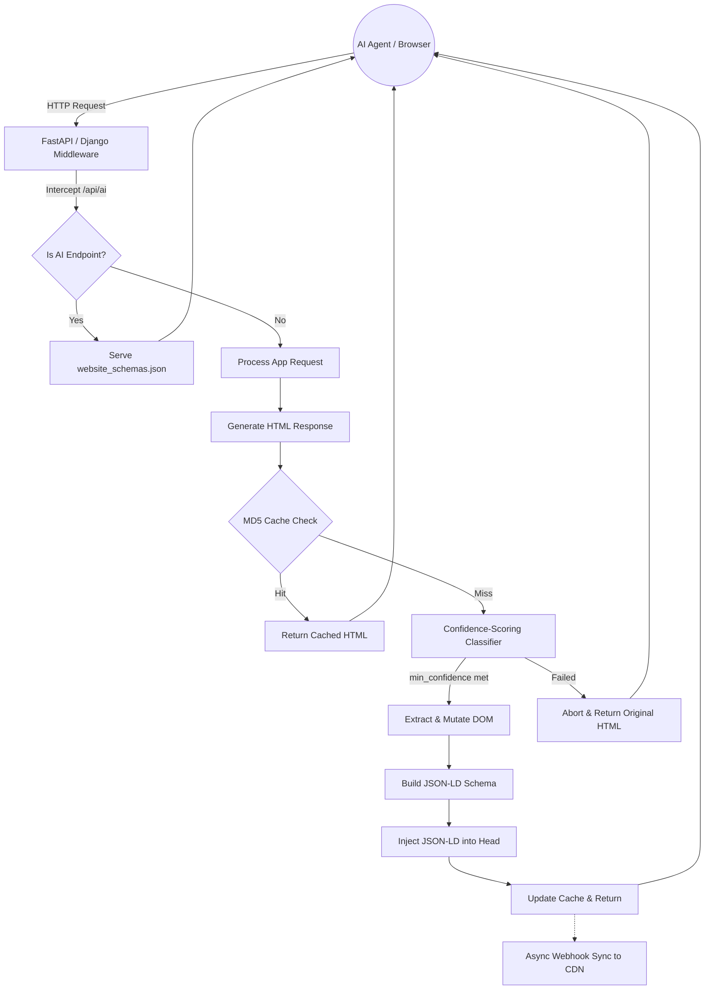

# AutoAI-Optimize (Enterprise Edition)

> **Don't just rank on Google. Get cited by AI for Free.**
> *Make your website natively readable by ChatGPT, Google, and Siri—in just one line of code.*

[](https://badge.fury.io/py/autoai-optimize) 
[](https://opensource.org/licenses/MIT)

**AutoAI-Optimize** is an enterprise-grade Python library that automatically translates your web application into structured data (JSON-LD / Schema.org) so that AI Agents can natively understand your business.

By making your website semantically readable, you dramatically improve **SEO**, **Voice Search Readiness (Siri, Alexa)**, and compatibility with next-generation **AI Search Engines (SearchGPT, Google AI Overviews, Perplexity)**.

## Why This Matters (For Business & Marketing Leaders)
AI Search Engines don't "read" websites the way humans do. If an AI can't parse your product catalog or blog, you lose traffic. 
1. **Higher CTR:** Studies consistently show that pages with structured JSON-LD earn higher click-through rates in search results (source: [Google Search Central](https://developers.google.com/search/docs/appearance/structured-data/search-results)). Your mileage varies — measure your own A/B results.
2. **Faster Indexing:** Trigger webhook notifications to AI engines on deploy, rather than waiting 24+ hours for traditional crawlers. *(Requires configuring a third-party indexing API — see webhook docs.)*
3. **AI Search Visibility:** Perplexity, Claude, and Gemini heavily prioritize websites that offer well-structured data.
4. **Response-Time Processing:** The library generates JSON-LD at response time from live HTML — no manual JSON editing required. *(Note: Schema reflects whatever HTML is rendered at request time; if content changes in the database, the JSON-LD updates on the next page render.)*

## Why This Matters (For Engineering Leaders)
This library is built with a highly modular architecture focused on **performance** and **safety**:
1. **Sub-0.02ms Latency Caching:** Incorporates an MD5 in-memory hashing engine. After the first load, repeated hits to unchanged HTML are served with sub-0.02ms compute overhead (measured: 0.0028ms median for small pages).
2. **Confidence-Scoring Classifier:** We use a proprietary scoring system (checking URL paths, HTML tags, and OpenGraph metadata). If a page doesn't meet the `min_confidence` threshold, the library safely aborts, ensuring we never hallucinate a `node_modules` page as an Article.
3. **Semantic DOM Mutations:** Automatically injects `data-ai-field` and `data-ai-action` attributes directly into your HTML nodes, providing immense value for screen readers and visual AI agents.

## Dual-Channel AI Discovery
AutoAI-Optimize addresses **both** methods that AI agents use to crawl the web:
1. **Bulk Crawlers (Googlebot, SearchGPT):** The optional `/api/ai` endpoint (opt-in, with bearer auth) serves your `website_schemas.json` manifest in one shot — no HTML parsing needed.
2. **Direct Visitors (ChatGPT, Claude, Perplexity):** When a user drops a link into ChatGPT, the bot visits the HTML directly. AutoAI-Optimize's **Inline JSON-LD Injection** ensures the AI reads the `<script type="application/ld+json">` tag instead of guessing from messy markup.

Currently supports **3 Schema.org types**: `Article`, `Product`, and `Profile`. Additional types (Organization, FAQ, Event, etc.) are planned for future releases.

## Performance Proof (Measured, Not Claimed)
Developers naturally hesitate to add middleware. We measured the overhead across three payload tiers with 100 repetitions each — run `python benchmark.py` yourself.

| Payload | Cold Start (mean) | Warm Cache Hit (median) | Description |
|---------|-------------------|----------------------|-------------|
| **Small (~0.3KB)** | `1.01 ms` | `0.0028 ms` | Minimal page, single product. |
| **Medium (~50KB)** | `17.02 ms` | `0.0147 ms` | Realistic product page with nav/footer. |
| **Large (~500KB)** | `85.09 ms` | `0.3475 ms` | Long-form article with heavy markup. |

> Concurrency (8 threads, 400 contended calls): **0.012ms** per call, zero errors. Rotating pool (200 unique pages, 1000 requests): **0.121ms** per call.

## System Architecture



---

## Installation

Install using pip:
```bash
pip install autoai-optimize
```

---

## 🚀 How to Use (Code Snippets)

### 1. Cloud Sync & Real-Time Webhooks
Instantiate the library to sync your real-time data to global CDNs. 

```python
import os
from autoai_optimize.core import sync_updates
from autoai_optimize.config import Config

# SECURE INITIALIZATION: Always load API keys from environment variables
# CDNs api key
api_key = os.getenv("AUTOAI_API_KEY")
config = Config(api_key=api_key)

# Push updates to AI search systems instantly
@app.route("/api/webhook", methods=["POST"])
def on_deploy():
    sync_updates(config) # Pings global CDNs that your schema has changed
    return "OK"
```

### 2. Processing HTML & Generating Manifests (CLI)
You can process an entire folder of HTML files using the built-in scanner. This detects entities, calculates clean relative URLs, and builds a comprehensive analytics manifest.

```bash
python demo.py --folder ./my_website --domain www.mysite.com
# or
python demo.py ./my_website -o website_schemas.json
```
This generates a JSON manifest file (`mysite_schemas.json` when `--domain` is provided, otherwise `website_schemas.json` by default).

### 3. FastAPI Integration
Add our zero-config middleware to handle everything automatically.

```python
from fastapi import FastAPI
from autoai_optimize.frameworks.fastapi import AutoAIMiddleware
from autoai_optimize.config import Config

app = FastAPI()

# Enterprise Security: Strictly block /admin routes from being scanned
# to prevent PII (Personally Identifiable Information) leaks.
config = Config(deny_paths=("/admin/", "/private/"))

app.add_middleware(AutoAIMiddleware, config=config)
```

### 4. Django Integration
Add the middleware to your `MIDDLEWARE` list in `settings.py`:

```python
# settings.py
MIDDLEWARE = [
    'django.middleware.security.SecurityMiddleware',
    'autoai_optimize.frameworks.django.AutoAIMiddleware', # Add near the top
    # ...
]

# Configure Security & Strict Routing
AUTOAI_OPTIMIZE = {
    "enabled": True,
    "min_confidence": 0.5,
    "deny_paths": ["/admin/"], 
    "ai_endpoint": "/api/ai"
}
```

---

## ⚡ The Super-Fast AI Endpoint (`/api/ai`)
If you generated a schema file using the folder scanner (e.g., `website_schemas.json`), our Django and FastAPI middlewares automatically intercept requests to `/api/ai` and serve the JSON file directly. 

This skips HTML rendering entirely and delivers your entire website structure to AI agents (like ChatGPT) with negligible latency (a single disk-read, typically under 5ms).

---

## 🛠️ Overriding the AI (Developer Hints)
Sometimes the AI needs a little help. We support explicit hints for both Frontend and Backend engineers.

**For Frontend Engineers (HTML Comments):**
Simply drop an HTML comment in your template, and our engine will parse it automatically.
```html
<!-- @ai-entity:product -->
<html>...</html>
```

**For Backend Engineers (Route Injections):**
If you are passing data dynamically, you can attach hints directly to your routes.
```python
# FastAPI Example
@app.get("/products/{id}")
async def get_product(id: int):
    get_product.autoai_hints = {"type": "Product", "name": "Widget", "price": "29.99"}
    return HTMLResponse(...)
```

## Security & Enterprise Compliance
When connecting your codebase to global AI indexing services, security is a top priority:
1. **No Hardcoded Keys:** Always load your API keys via environment variables (e.g., `os.getenv("AUTOAI_API_KEY")`).
2. **Preventing Data Exfiltration (GDPR):** You should strictly enforce the `deny_paths` configuration on private user routes (e.g., `/admin/*`, `/dashboard/*`) to avoid accidentally pushing PII to AI search models. 
3. **Idempotency:** Set `inject_existing=True` in the config. The library will not double-inject JSON-LD if it detects that the page has already been seeded by another system.

## Production & Migration Notes

This release includes several production-grade improvements for sites with high traffic and large content skirts. Key operational points:

- Caching: an in-memory thread-safe LRU cache with TTL avoids re-parsing unchanged HTML. Use the offload pre-scan to populate the cache during deploys for zero-cost hits at runtime.
- Async-safe middleware: FastAPI/Starlette adapter offloads CPU-bound parsing to a threadpool so the event loop is never blocked.
- Idempotency: injection now detects identical JSON-LD nodes by @type+url or exact node equality to avoid duplicates.
- Security: deny_paths, allow_paths, and require_explicit_opt_in + sensitive_paths exist to prevent scanning PII routes. Always set api_key via environment for webhook sync.
- Webhook reliability: sync_updates uses retries and exponential backoff and requires API key in Authorization header.
- Observability: an optional METRICS counters object exposes in-process counters (served.cache_hit, served.enriched, errors.*) for integration with host metrics.
- Price parsing: locale-aware extraction covers common formats (USD, EUR, INR, GBP).
- JS-heavy sites: a detect_js_rendered heuristic warns when pages are likely client-rendered; use prerendering or the offload tool for those pages.

Migration steps for large sites:
1. Run: python -m autoai_optimize.offload prepopulate_cache_from_folder <site_folder> during deploy.
2. Enable require_explicit_opt_in=True and set allow_paths to whitelist public content if you want strict control.
3. Provide AUTOAI_API_KEY in environment and configure webhook_url for CDN sync.

## Release 1.0.1 — 2026-07-11

This release addresses the comprehensive review in IMPROVEMENTS.md:

- **Django middleware bug fix**: fixed `response.pop("Content-Length")` crash (`HttpResponse` has no `.pop()`)
- **Price parsing fixes**: post-symbol prices (`49.99£`), EU decimal commas (`1.234,56 €`), currency-code prefix (`EUR 1.234,56`)
- **`<time>` element fix**: `datePublished` now correctly extracted from `<time datetime="...">` tags
- **Idempotency fix**: relative vs absolute URL mismatch no longer causes duplicate JSON-LD injection
- **Test coverage**: 61 → 141 tests, 72% → 89% coverage, Django middleware 0% → 93%
- **CI pipeline**: GitHub Actions workflow (pytest + coverage on Python 3.10/3.11/3.12)
- **Benchmark rewrite**: statistical (100 reps, mean/median/stdev), 3 payload tiers, no-middleware baseline, concurrency, rotating-pool, classifier accuracy
- **README accuracy**: sourced marketing claims, measured performance numbers
- **PyPI classifier**: updated to `4 - Beta`

### Verification status (2026-07-11)

Ran full test suite from project root with:

```powershell
$env:PYTHONPATH = "src"; python -m pytest --cov=autoai_optimize --cov-report=term-missing
```

Result: **141 passed, 1 warning** (Starlette TestClient deprecation warning) — **89% coverage**.

## License
MIT
